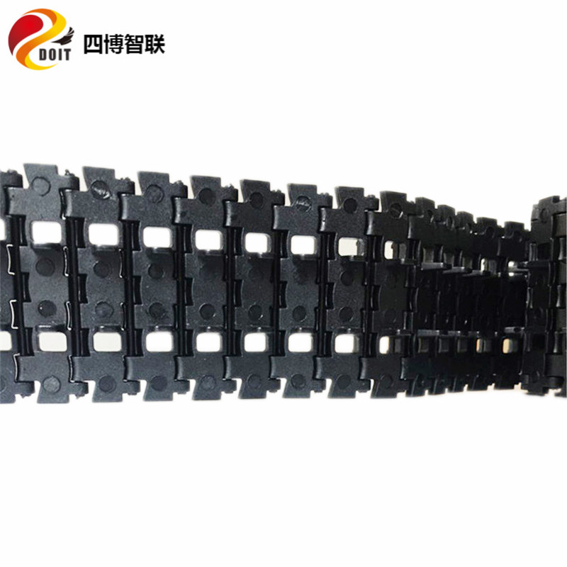
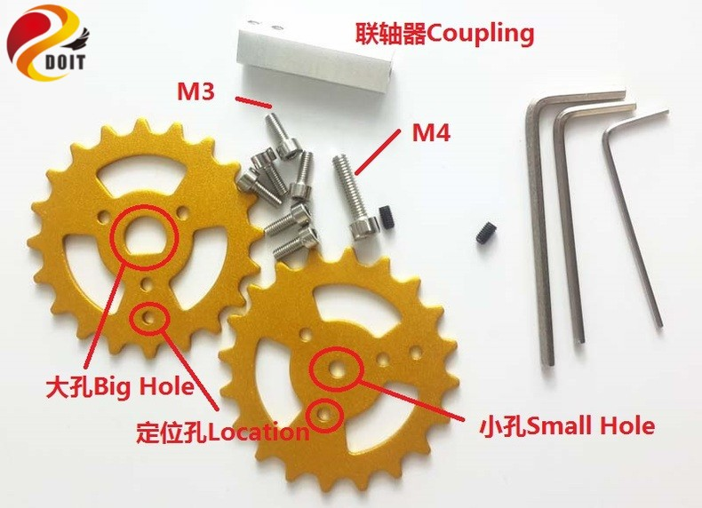
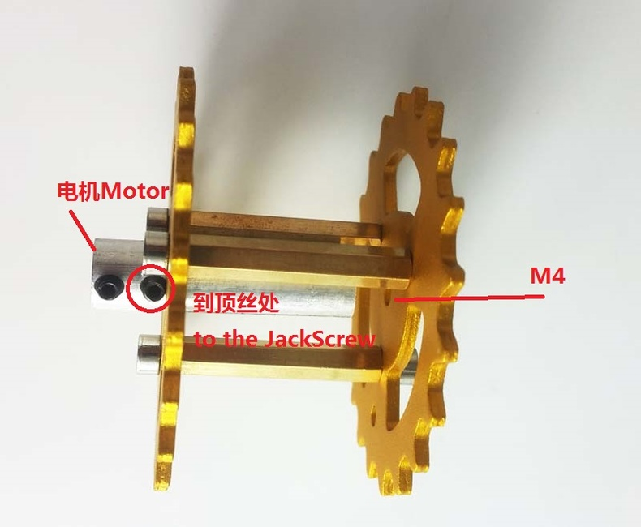
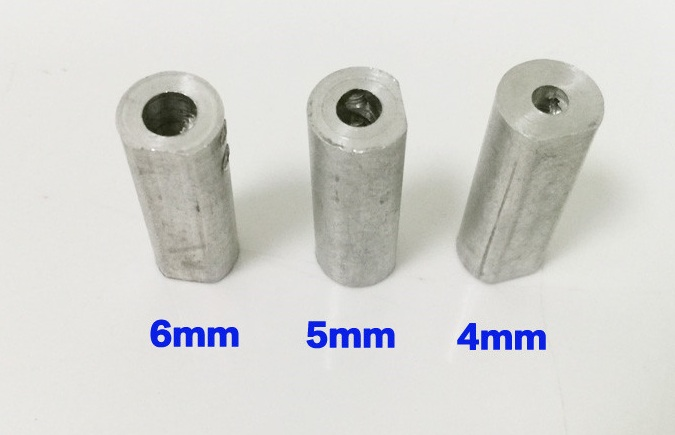
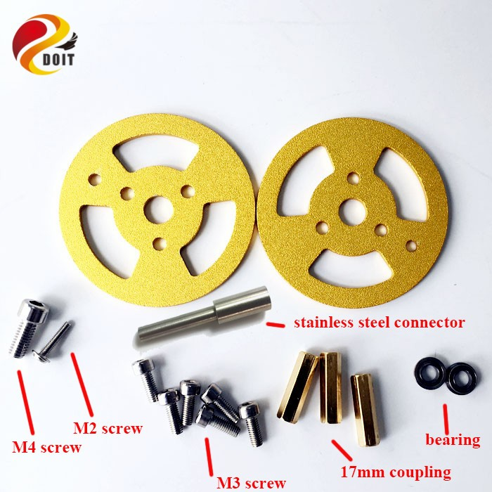
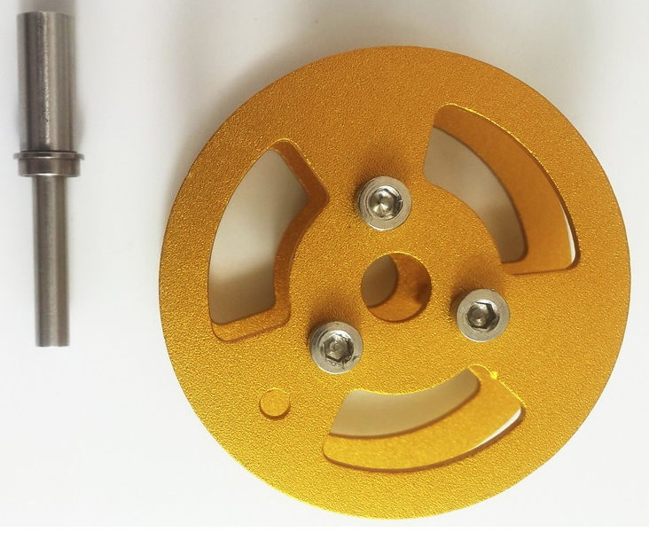

=================
Accessories for Robot Tank Car Chassis
=================

:Date:   2018-01-30

In this part, we will provide some assembling document, examples video, source code, and user manual for DOIT robotics.

Track/Caterpillar/Pedrail for Tank car chassis
-------------------------

About Stripping
^^^^^^^^^^^

This caterpillar is generally used for the assembling tank, which is connected one by one. So, we can change the length for the caterpillar for our requirment, as shown in the following picture.

  .. figure:: ../_static/caterpillarpull.jpg
    :align: center
    :alt: Stripping the carterpillar
    :figclass: align-center

     Stripping the carterpillar
    
 Also, we can watch the vido to know the stripping caterpillar: `Stripping the caterpillar <http://v.youku.com/v_show/id_XMTg4NzYyMzY4NA==.html?spm=a2hzp.8253869.0.0>`_

In fact, we have the following two types of caterpillar: TC-09 AND TC-03.

Caterpillar TC-09
^^^^^^^^^^^
The caterpillar TC-09 can be seen as following picture.

 .. figure:: ../_static/tc09.jpg
   :align: center
   :alt: Caterpillar TC-09
   :figclass: align-center
    
    Caterpillar TC-09

How to order

 Now, we have the following two types of caterpillar: metal and plastic one. As for the assembling, they are no difference, just excluding the materials: one is plastic, and another is metal. But metal caterpillar looks very cool. If you want to order, please move to this links: 
 
 * `Plastic caterpillar TC-09 <http://vvdoit.com/original-doit-2pcspair-plastic-caterpillar-chain-track-pedrail-thread-tracker-wheel-for-tank-chassis-diy-rc-toy-remote-control-p779205.html>`_ 
 * `Metal caterpillar TC-09 <http://vvdoit.com/original-doit-caterpillar-chain-track-wheel-for-robot-model-crawler-obstacle-surmounting-with-high-torque-motors-and-hall-sensor-p834293.html>`_ 
 
Caterpillar TC-03
^^^^^^^^^^^ 

The caterpillar TC-03 can be seen as following picture.

    
    Caterpillar TC-03
    
The order link: `Plastic caterpillar TC-03 <http://vvdoit.com/original-doit-shock-absorption-plastic-track-for-robot-tank-car-chassis-caterpillar-crawler-conveyor-belt-diy-smart-chain-wheel-p779512.html>`_
 
.. Note::
 
 * The standard length for the two types of caterpillar TC-09 AND TC-03, and their size are the same show as follows.
   80cm*4.5cm (length*width);
 * The stripping ways for the caterpillar are the same;
 * The difference for TC-09 AND TC-03 is for the middle. For TC-03 has two small holes, while TC-09 JUST has one small holes;
 * The assembling is the same.

Wheels for Tank
----------

The wheel for tank has driving wheel and bearing wheel. And each wheel can be metal and plastic. Especially, considering the caterpillar is different, so there are different wheels for caterpillar TC-09 and TC-03.

Driving wheels for the caterpillar TC-09
^^^^^^^^^^

Metal Driving Wheel TW-09
^^^^^^^^^^^

The parameters can be seen as the follows:

* Name: metal driving wheel
* Color: silver and golden yellow
* Material: aluminum alloy
* Color: silver/yellow
* Inner size for the coupling of the wheel: 4mm/5mm/6mm
* Type: driving
* Size: 31.85 (distance for coupling)*48.03 (diameter)*34.08 (for bearing connector) mm

.. figure:: ../_static/drivingwheeltc09.jpg
   :align: center
   :alt: Metal driving wheel suitable for TC-09
   :figclass: align-center
    
    Metal driving wheel suitable for TC-09

    
    List for metal driving wheel
    
.. figure:: ../_static/drivingwheelalign.jpg
   :align: center
   :alt: Align metal driving wheel
   :figclass: align-center
    
    Align for metal driving wheel
 

    
    Assembling metal driving wheel

To be fitable the different size for the motor axis, we have the following three size coupling for this wheel: 4mm, 5mm, and 6mm.

    
    Coupling for driving wheel

 Plastic Driving Wheel
 
 The following plastic driving wheel can be used for the caterpillar TC-09.
 
.. figure:: ../_static/Pdrivingwheelcoupling.jpg
   :align: center
   :alt: Plastic driving wheel
   :figclass: align-center
    
    Plastic driving wheel
    
 But the related coupling for this plastic driving wheel is as follows. It has 4mm, 5mm, and 6mm from the size.
 
 .. figure:: ../_static/Pdrivingwheelcoupling.jpg
   :align: center
   :alt: Coupling for plastic driving wheel
   :figclass: align-center
    
    Coupling for plastic driving wheel
 
 .. Note::
 
 * In the default case, the coupling must be bought;
 * The assembling method is the same in the following driving wheel for TC-03;
 
Bearing Wheel TB-09
^^^^^^^^
The bearing wheel can be seen as follows, which is assembled by two bearings. So the friction is very small, and can make the wheel move smoothly. The parameters is as follows.

Name: metal bearing wheel
Color: silver and golden yellow
Material: aluminum alloy
Type: bearing
Size: 20.75 (distance for coupling)*47.50 (diameter)*38 (for bearing connector) mm

    
    List of bearing wheel TB-09
    

    
    Bearing wheel TB-09 
    
 .. figure:: ../_static/TB092.jpg
   :align: center
   :alt: Bearing wheel TB-09
   :figclass: align-center
    
    Bearing wheel TB-09  
 
 
 
Contact Us
--------
 
 * WhatsApp: +18676662425
 * Emails: yichone@doit.am; yichoneyi@163.com
 * Skype: yichone
 * Official site: `www.doit.am <http://www.doit.am/>`_
 * official shop: `www.vvdoit.com <http://www.vvdoit.com/>`_; `www.smartarduino.com <http://www.smartarduino.com/>`_.
