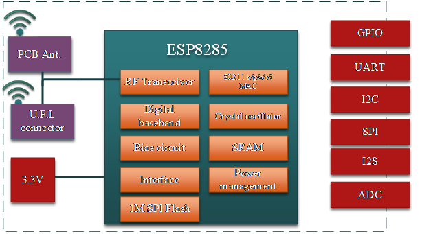

User Manual for ESP-S
==============================

Introduction
------
The WiFi module ESP-M is manufactured by using a high-performance chip ESP8285. This small chip is encapsulated an enhanced Tensilica’sL106  diamond series 32-bit kennel CPU with a SRAM. Thus, ESP8285 has the complete function Wi-Fi function; it not only can be applied independently, but can be used as a slaver working with other host CPU. When ESP8285 is applied as a slaver, it can start from the onboard Flash.  The built-in high-speed buffer is not only benefit to improve the system performance, but optimize the store system. In addition, ESP8285 can be used as Wi-Fi adapter by SPI/SDIO or I2C/UART interface, when it is applied to other MCU design.

The ESP-M module supports the standard IEEE802.11 b/g/n/e/i protocol and the complete TCP/IP protocol stack. User can use it to add the  WiFi function for the installed devices, and also can be viewed as a independent network controller.  Anyway, ESP-M module provides many probabilities with the best price.

    ESP-M Module Structure
    
Features
----
SOC characteristics
^^^^^^^^
* Built-in Tensilica L106 ultra-low power consumption 32-bit cpu,  the main frequency can be  80MHz and 160MHz,  also support RTOS;
* Built-in TCP/IP protocol stack;
* Built-in 1 channel 10-bit high precision ADC;
* The outside interfaces have HSPI, UART, I2C, I2S, IR Remote Control, PWM, GPIO;
* The deep-sleep current is about 10uA, and the cut-off current is smaller than 5uA;
* Can be wake-up within 2 ms, and connect to transmit data package;
* the consume power is smaller than 1.0mW (DTIM3) when at standby status;
* built-in 1M byte for SPI Flash.
Wi-Fi characteristics
^^^^^^^^^
* Support 802.11 b/g/n/e/i
* Support three modes: Station, SoftAP, and SoftAP+STA;
* SupportWi-Fi Direct(P2P);
* Support hardware acceleration for CCMP (CBC-MAC, computation mode), TKIP (MIC, RC4), WAPI(SMS4), WEP(RC4), CRC;
* P2P find, P2P GO mode/GC mode and P2P power management;
* WPA/PA2 PSK and WPS;
* Support 802.11 i  security: pre-certification and TSN;
* Support 802.11n (2.4 GHz);
* 802.1h/RFC1042 frame encapsulation;
* Support seamless roam; 
* Support AT remote updation and cloud OTA updation;
* Support SmartConfig function for Android and iOS device SmartConfig.

Peripheral for Module
---------
* 2*UART;
* 1*En;
* 1*ADC;
* 1*wakeup pin;
* 1*HSPI;
* 1*I2C;
* 1*I2S;
* MAX 10* GPIOs;
* Working temperature: -40℃-125℃
* Module size: 
* 12.3*mm*15mm; (M1 version)
* 12.3*mm*20mm; (M2 version)

Application
--------
* Serial Transparent transmission;                        
* Smart power plug/Smart LED light;                      
* Sensor networks;        
* Wearable electronics;
* Securit ID label;       
* Wireless location recognition;
* Wireless location system beacon; 
* WiFi prober;
* Mesh networks;
* Industrial wireless control.

Module Type
-----
+----------+-----------------------+
|  Name    |     Antenna Type      |
+==========+=======================+
|  ESP-M1  | IPEX external antenna |
+----------+-----------------------+
|  ESP-M2  |  PCB on board antenna |
+----------+-----------------------+

